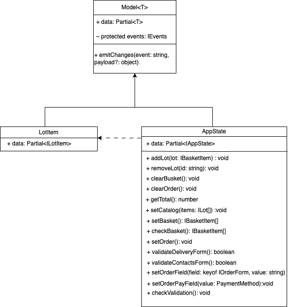

# Проектная работа "Веб-ларек"

Проект магазина где за внутреннюю валюта можно преобрести веб-айтемы.

Стек: HTML, SCSS, TS, Webpack
Паттерн программирования: упрощённая версия архитектурного паттерна MVP.

Структура проекта:

- src/ — исходные файлы проекта
- src/components/ — папка с JS компонентами
- src/components/base/ — папка с базовым кодом

Важные файлы:

- src/pages/index.html — HTML-файл главной страницы
- src/types/index.ts — файл с типами
- src/index.ts — точка входа приложения
- src/sсss/styles.scss — корневой файл стилей
- src/utils/constants.ts — файл с константами
- src/utils/utils.ts — файл с утилитами

## Установка и запуск

Для установки и запуска проекта необходимо выполнить команды

```
npm install
npm run start
```

или

```
yarn
yarn start
```

## Сборка

```
npm run build
```

или

```
yarn build
```

## Описание данных

Интерфейс с данными для карточки.

```
interface ILotItem {
    id: string;
    description?: string;
    image: string;
    title: string;
    category: string;
    price: number | null;
    Button: boolean;
}
```

Тип для товара в корзине.

```
type BusketItem = Pick<LotItem, 'id' | 'title' | 'price'>& {index?: number;}
```

Интерфейс для данных отображенных в корзине, массив товаров и типы для данных заказа.

```
interface Bucket {
   items: BusketItem[];
   order: IOrder;
   total: number;
}
```

Интерфейсы для формы заказа.

```
interface IOrderForm {
    email: string;
    phone: string;
    adress: string;
    payment: PaymentMethod;
    total: number;
}
```

Интерфейс для заказа.

```
interface IOrder extends IOrderForm {
    items: string[];
}
```

Тип для выбора метода оплаты.

```
type PaymentMethod = 'cash' | 'card'
```

Интерфейс для попапа "Заказ оформлен".

```
interface IOrderResult {
    id: string;
    total: number;
}
```

Интерфейс для всех данных компонентов приложения.

```
interface IAppState {
    catalog: LotItem[];
    basket: string[];
    preview: string | null;
    order: IOrder | null;
}
```

Тип для ошибок формы.

```
type FormErrors = Partial<Record<keyof IOrder, string>>;
```

## Компоненты представления(Presenter)

**_Слой архитектуры необходимый для связывания слоя Model и слоя View._**
В качестве презентера выступает корневой файл index.ts, описывающий взаимодействие отображения и данных между собой

###Класс Api.
Базовый класс для работы с серверными данными.
Принимает в конструктор:

1. baseUrl: string – базовый адрес
2. options: RequestInit = {} – свойства
   Имеет методы:
3. Get(uri: string) - получить данные с сервера.
4. post(uri: string, data: object, method: ApiPostMethods = 'POST') - отправить данные на сервер.

###Класс WebLarekApi.
Наследует класс Api и имплементирует интерфейс ILarekAPI.

```
interface ILarekAPI {
    getLotList: () => Promise<ILotItem[]> - получить каталог лотов.
    getLotItem: (id: string) => Promise<ILotItem> - получить лот.
    orderLots: (order: IOrder) => Promise<IOrderResult> - получить результат заказа.
}
```

Принимает в конструктор:
1.cdn: string — каширование ссылок на изображения.
2.baseUrl: string — базовый адрес.
3.options?: RequestInit —

Имеет методы интерфейса ILarekAPI.

###Класс EventEmitter.
Реализует паттерн «Наблюдатель» и позволяет подписываться на события и уведомлять подписчиков
о наступлении события.

Имеет методы:

1. On - установить обработчик на событие.
2. Off - снять обработчик с события.
3. Emit — для подписки на событие, отписки от события и уведомления подписчиков о наступлении события соответственно.
4. onAll - установить обработчики на все.
5. offAll - убрать обработчики со всех.
6. trigger - генерирует заданное событие с заданными аргументами. Это позволяет передавать его в качестве
   обработчика события в другие классы. Эти классы будут генерировать события, не будучи при этом напрямую зависимыми от
   класса EventEmitter .

Список событий.

- 'basketContent:changed' - изменение содержимого корзины
- 'basket:open' - открытие корзины
- 'items:changed' - изменение каталога
- 'order:ready' - открытие окна успешного заказа
- 'order:open - открытие формы заказа
- 'order:submit' - форма отправлена
- 'deliveryErrors:change' - изменение состояния формы доставки
- 'formErrors:change' - изменение состояния формы контактов
- 'modal:open' - открытие попапа
- 'modal:close' - закрытие попапа
- 'card:select' - открытие превью

## Модели данных(Model)

**_Слой архитектуры необходимый для хранения и изменения данных._**



###Класс Model<T>
Базовый абстрактный класс типа дженерик — принимает в переменной T тип данных.
Принимает в конструктор:

1. data: Partial<T> — опциональные свойства данных.
2. protected events: IEvents — защищенные события.

Имеет метод:
emitChanges(event: string, payload?: object) — принимает как аргумент событие, и опциональный параметр данные.
Метод нужен чтобы сообщить что произошло какое-то событие и изменить данные.

###Класс LotItem
Наследует класс Model. Нужен для создания обьктов лотов.
Принимает в конструктор:

1. data: Partial<ILotItem>
   Собственных методов не имеет.

###Класс AppData
Наследует абстрактный класс Model и содержит методы для работы и изменения данных проекта.
Принимает в конструктор:

1. data: Partial<IAppState>

Имеет методы:

1. addLot(lot: IBasketItem):void - добавить лот в корзину.
2. removeLot(id: string): void - удалить лот из корзины.
3. clearOrder(): void - очистить данные из заказа.
4. clearBasket(): void - очистить корзину после заказа.
5. getTotal(): number - получить общую сумму заказа.
6. setCatalog(items: LotItem[]): void - получить данные всех товаров.
7. setBasket(): IBasketItem[] - получить список товаров в корзине.
8. checkBasket(item: IBasketItem): boolean - проверить есть ли лот в корзине(для того чтобы сменить надпись на кнопке)
9. setOrder(): void - получить данные для оформления заказа.
10. setOrderPayField(value: PaymentMethod):void - передать в поле оплаты заказов выбранный пользователем вариант.
11. setOrderFormField(field: keyof Pick<IOrder, 'address' | 'email' | 'phone' >, value: string ):void - передать в остальные поля форм заказов данные пользователя.
12. checkValidation(): void - проверить прошли ли данные пользователя валидацию.
13. validateDeliveryForm():boolean - валидация формы оплаты и доставки.
14. validateContactsForm():boolean - валидация формы контактов.

## Компоненты отображения(View)

**_Слой архитектуры необходимый для отображения данных на странице._**
###Класс View
Базовый абстрактный класс типа дженерик — принимает в переменной T тип данных. Реализует методы отвечающие за отображение
данных на странице. Такие как:

1. toggleClass(element: HTMLElement, className: string, force?: boolean) - преключаем класс в зависимости от булевого значения.
2. protected setText(element: HTMLElement, value: unknown) - установить содержимое элементу.
3. setDisabled(element: HTMLElement, state: boolean) - заблокировать элемент в зависимости от булевого значения.
4. protected setHidden(element: HTMLElement) - защищенный метод скрывающий элемент.
5. protected setVisible(element: HTMLElement) - защищенный метод показывающий элемент.
6. protected setImage - установить изображение и описание к нему.
7. render(data?: Partial<T>): HTMLElement - вывод контейнера на страницу.

###Класс Popup
Наследует класс View. Отвечает за отрисовку модальных окон. Будет иметь методы:
1.Закрыть 2. Открыть 3. Наполнить контентом

###Класс Page
Наследует класс View. Отвечает за отрисовку главной страницы. Имеет методы:

1. Отрисовка каталога.
2. Отрисовку счетчика на корзине.
3. Блокировку прокручивания страницы.

###Класс Card
Наследует класс View. Отвечает за отрисовку карточки товара. Будет иметь методы реализующие отрисовку деталей карточки.

###Класс Basket
Наследует класс View. Отвечает за отрисовку корзины.

###Класс Form
Наследует класс View. Отвечает за блокировку кнопок, показ ошибок и отрисовку формы.

###Класс Success
Наследует класс View. Отвечают за отрисовку окна успешного заказа.

###Класс Order
Наследует класс Form. Отвечает за отрисовку форм заказа.
